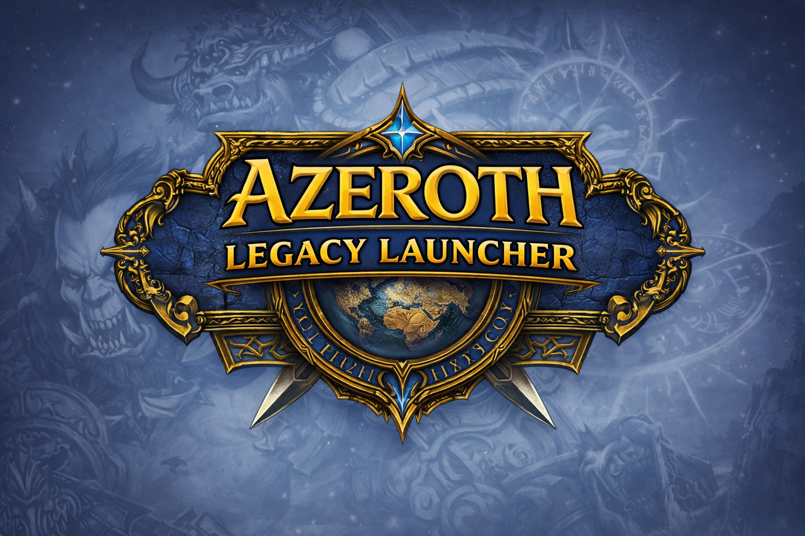
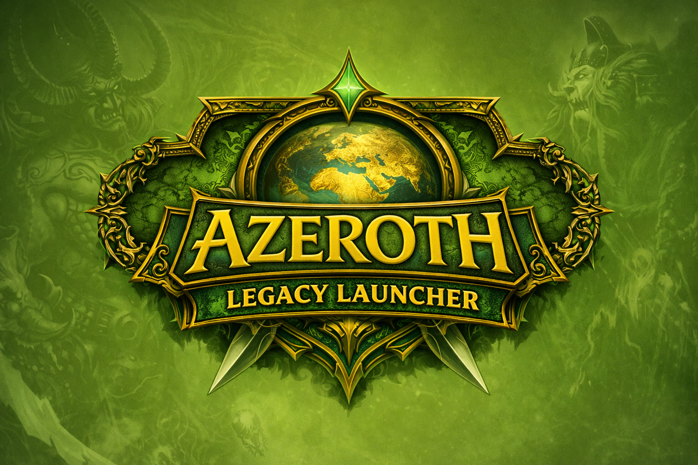
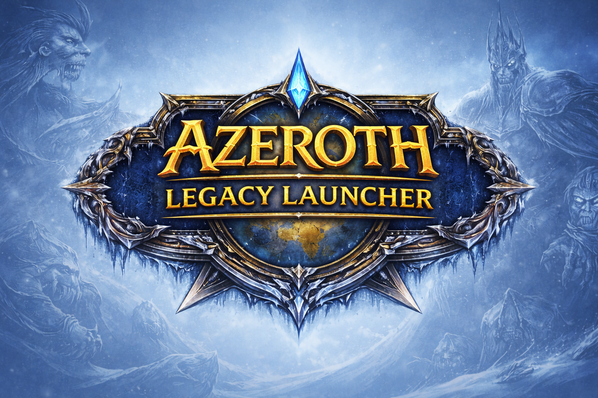

# ⚔️ Relictum Launcher

<div align="center">


**The ultimate, secure, and modern launcher for private servers.**
*Supports 1.12.1 • 2.4.3 • 3.3.5a*


[Download Latest Release](https://github.com/Litas-dev/Relictum-Launcher/releases) • [Report Bug](https://github.com/Litas-dev/Relictum-Launcher/issues) • 

</div>

---

## 📖 About

The **Relictum Launcher** is a powerful, open-source universal launcher designed to modernize your experience across multiple expansions. Whether you play on **1.12.1**, **2.4.3**, or **3.3.5a**, this launcher provides unparalleled security, automated game management, and a seamless addon ecosystem.

It is the first private server launcher to feature **Advanced Integrity Verification**, ensuring that your client code is authentic, safe, and unmodified.

## ✨ Key Features

### 📸 Interface Preview

<div align="center">
  
  
  
</div>
<br/>

### 🛡️ Security & Integrity (New in v3)
*   **ASAR Code Verification**: Unlike standard launchers that only check the `.exe`, we verify the cryptographic hash of the internal `app.asar` code archive.
*   **Real-Time Dashboard**: A dedicated security status card in the "About" section provides instant feedback (Secure/Warning/Danger).
*   **Active Threat Monitoring**: Immediate visual alerts on the sidebar if any integrity mismatch is detected.

### 🧩 Next-Gen Addon Manager
*   **Universal Browser**: Browse and install addons.
*   **One-Click Install**: No more unzipping or manual folder management. Just click "Install".
*   **Smart Grouping**: Automatically groups multi-module addons into single, clean entries.
*   **Local Management**: Easily update or delete your existing addons.

### 🎨 Immersive Experience
*   **Integrated Music Player**: Enjoy the iconic soundtracks while you browse.
*   **Classic Layout**: A refined user interface that pays homage to the original game launcher while using modern glass-morphism effects.

### ⚡ Smart Game Management
*   **Multi-Version Support**: Built-in support for managing **1.12.1**, **2.4.3**, and **3.3.5a** clients.
*   **Auto-Locate**: Intelligently finds and verifies existing game installations for any supported version.

## 🛠 Tech Stack

*   **Core**: [Electron](https://www.electronjs.org/) (v28)
*   **Frontend**: [React](https://react.dev/) + [Vite](https://vitejs.dev/)
*   **Security**: SHA-256 Integrity Verification
*   **Styling**: CSS Modules + Modern CSS3
*   **Icons**: [Lucide React](https://lucide.dev/)

## 🚀 Getting Started

### For Users
1.  Go to the [Releases](https://github.com/Litas-dev/Relictum-Launcher/releases) page.
2.  Download `Relictum.Launcher.Setup.exe`.
3.  Run the installer. The launcher will automatically verify its own integrity on first launch.

### For Developers

**Prerequisites**
*   Node.js (v18 or higher)
*   npm (v9 or higher)

**Installation**

1.  **Clone the repository**
    ```bash
    git clone https://github.com/Litas-dev/Relictum-Launcher.git
    cd Relictum-Launcher
    ```

2.  **Setup MySQL Database**
    ```sql
    CREATE DATABASE relictum_launcher;
    ```

3.  **Setup Backend**
    ```bash
    cd server
    npm install
    cp env.example .env  # Configure your database credentials
    npm run db:test      # Test database connection
    npm run db:seed      # Populate with test data
    cd ..
    ```

4.  **Install Frontend dependencies**
    ```bash
    npm install
    ```

5.  **Run in development mode (Frontend + Backend + Electron)**
    ```bash
    npm run dev:full
    ```

6.  **Run only frontend**
    ```bash
    npm run dev
    ```

## 🏗️ Architecture

### Backend (MySQL + Express)
- **Framework**: Node.js + Express
- **Database**: MySQL with Sequelize ORM
- **Authentication**: JWT tokens
- **Real-time**: Socket.io for download progress
- **Security**: bcrypt, rate limiting, CORS, helmet

### Frontend (React + Electron)
- **UI**: React with modern hooks
- **Desktop**: Electron for cross-platform support
- **Styling**: CSS Modules
- **State**: Custom hooks for game/library management

### Database Schema
```
users (id, username, email, password, role, profile_data)
clients (id, client_id, name, version, files, stats)
downloads (id, user_id, client, status, progress, timestamps)
```

### API Endpoints
- `POST /api/auth/register` - User registration
- `GET /api/clients` - List available clients
- `POST /api/clients/:id/download` - Start download
- `GET /api/users/downloads` - User download history

## 🔧 Development Scripts

### Frontend
```bash
npm run dev          # Start frontend only
npm run build        # Build for production
```

### Backend
```bash
cd server
npm run dev          # Start backend with nodemon
npm run db:test      # Test database connection
npm run db:seed      # Populate database with test data
```

### Full Stack
```bash
npm run dev:full     # Start frontend + backend + electron
```

## 📊 Database Setup

### Prerequisites
- Node.js 16+
- MySQL 8.0+
- Git

### Database Configuration
Create a `.env` file in the `server/` directory:

```env
DB_HOST=localhost
DB_PORT=3306
DB_NAME=relictum_launcher
DB_USER=root
DB_PASSWORD=your_password
JWT_SECRET=your-secret-key
```

### Test Accounts
- **Admin**: admin@relictum.com / admin123
- **User**: user@test.com / test123

## 🚀 Production Build
